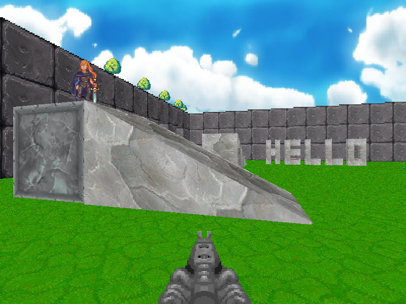
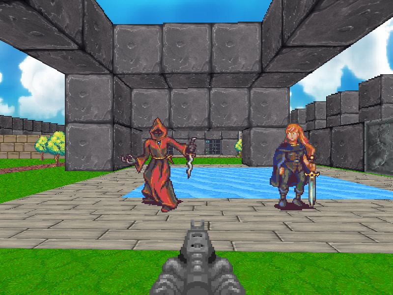
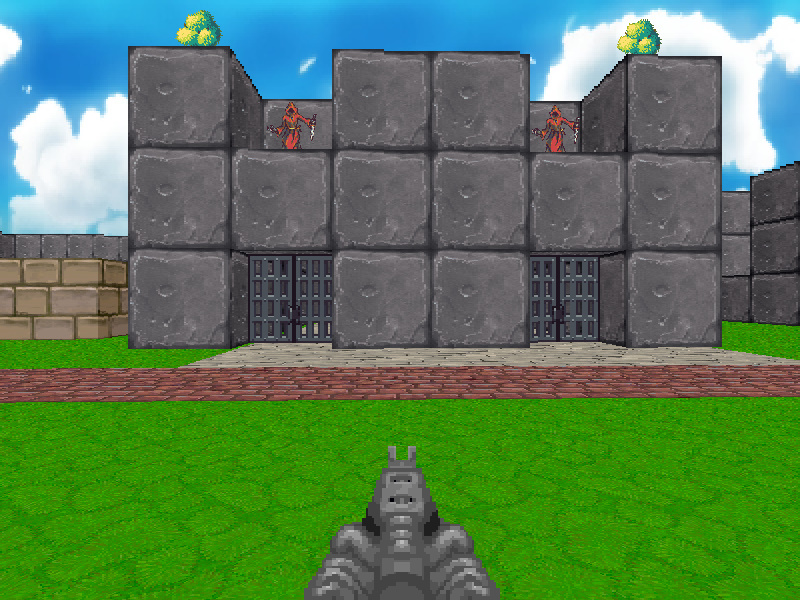
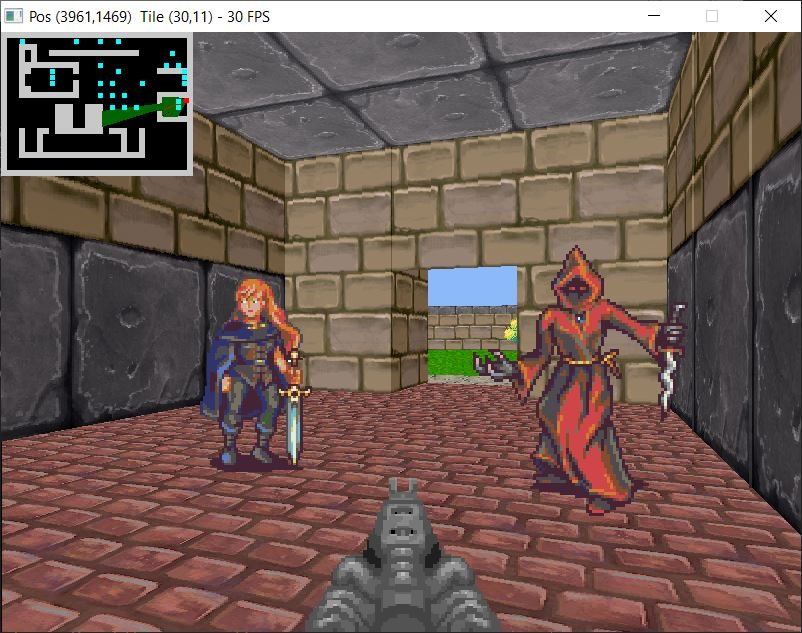

# SDL2 Raycasting Engine

This was originally a port of [my HTML5 canvas version here](https://github.com/andrew-lim/html5-raycast). If you just want to learn basic floor/ceiling texture mapping in a raycaster, I recommend studying the HTML5 version. The code is easier to read and can be run in your browser.

This C++ project has a few more features compared to the HTML5 version: vertical movement, wall top/bottom texture mapping, sprites and projectiles. There is also experimental support for thin angled walls and slopes.

You can see [videos of it in action here](https://www.youtube.com/watch?v=cYxKfS5-ABQ&list=PL4Pn9mFG1hxRhvl7PIsjKVW3evfVWzl7e&ab_channel=AndrewLim).

Download the [Windows demo here](https://github.com/andrew-lim/sdl2-raycast/releases/).

## Screenshots
<table style="padding:10px">
  <tr>
    <td width="50%"></td>
    <td width="50%"></td>
  </tr>
  <tr>
    <td width="50%"></td>
    <td width="50%"></td>
  </tr>
</table>

## Building
I highly recommending compiling with some kind of optimization enabled.  For Dev-C++ I use the `-O2` flag. The `-03` flag also works if `-fno-tree-vectorize` is specified as well.

You will need SDL2 and SDL2_mixer.

SDL2 version used is SDL2-devel-2.0.12-mingw.tar.gz  
https://www.libsdl.org/download-2.0.php

SDL2_mixer version used is SDL2_mixer-devel-2.0.4-mingw.tar.gz  
https://www.libsdl.org/projects/SDL_mixer/

So far I've only tested this with Dev-C++ 5.11  
https://sourceforge.net/projects/orwelldevcpp/

## Asset Credits

Sounds and images are from these OpenGameArt links:

https://opengameart.org/content/big-pack-of-hand-painted-tiling-textures

https://opengameart.org/content/first-person-dungeon-crawl-protagonist

https://opengameart.org/content/lab-sprites

https://opengameart.org/content/first-person-dungeon-crawl-art-pack

https://opengameart.org/content/2-high-quality-explosions

https://opengameart.org/content/4-projectile-launches

https://opengameart.org/content/lpc-animated-doors

https://opengameart.org/content/door-open-door-close-set

https://opengameart.org/content/cloudy-sky
