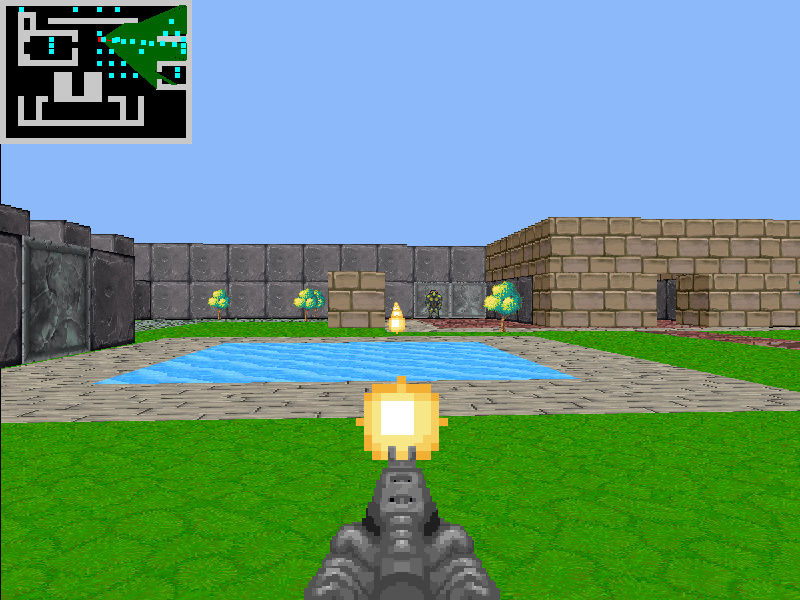
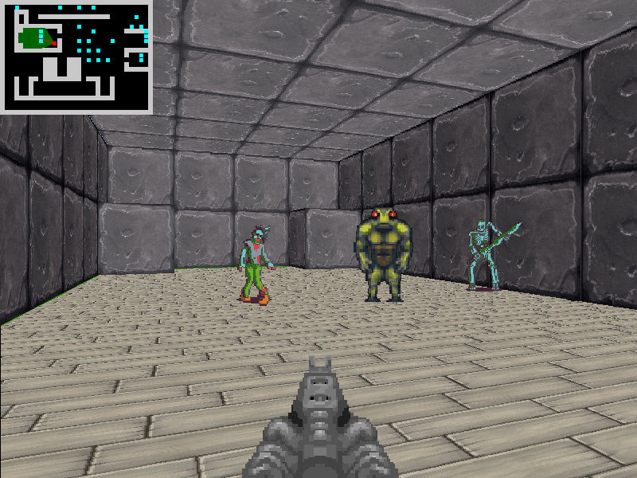

# SDL2 Raycasting Demo

This was originally a port of [my HTML5 canvas version here](https://github.com/andrew-lim/html5-raycast).
But there are many more features now including floor/ceiling texture mapping, sprites and projectiles.

You can see a [video of it here](https://www.youtube.com/watch?v=fEDtU9okUxA).

## Screenshots

## Building
You will need SDL2 and SDL2_mixer.

SDL2 version used is SDL2-devel-2.0.12-mingw.tar.gz.
https://www.libsdl.org/download-2.0.php

SDL2_mixer version used is SDL2_mixer-devel-2.0.4-mingw.tar.gz
https://www.libsdl.org/projects/SDL_mixer/

So far I've only tested this with Dev-C++ 5.11
https://sourceforge.net/projects/orwelldevcpp/

## Asset Credits

Sounds and images are from these OpenGameArt links:

https://opengameart.org/content/first-person-dungeon-crawl-protagonist

https://opengameart.org/content/lab-sprites

https://opengameart.org/content/first-person-dungeon-crawl-art-pack

https://opengameart.org/content/2-high-quality-explosions

https://opengameart.org/content/4-projectile-launches
