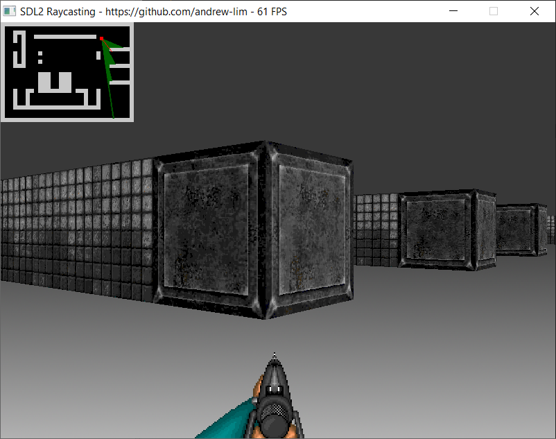

# SDL2 Rayast
A Wolfenstein 3D style raycaster using C++ and SDL2.

This is a port of [my HTML5 canvas version here](https://github.com/andrew-lim/html5-raycast).

Wall and gun textures are from Sporbs High Resolution Texture Pack by Kev Reid.

You can download the [Windows Demo here](https://github.com/andrew-lim/sdl2-raycast/releases/)

## Building
SDL2 version used is SDL2-devel-2.0.12-mingw.tar.gz.
https://www.libsdl.org/download-2.0.php

So far I've only tested this with Dev-C++ 5.11
https://sourceforge.net/projects/orwelldevcpp/

## Screenshot

